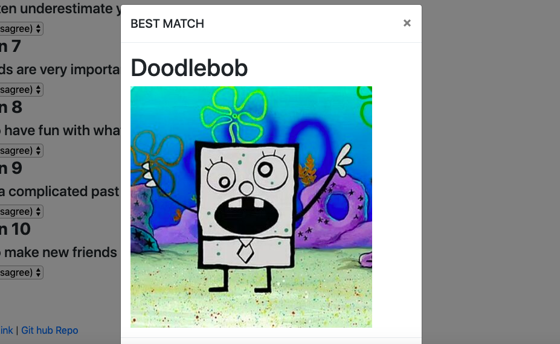

# Friend Finder

# What this app uses
* javascrpit
* node.js
* express
* path
* dotenv
* heroku
* api routes
* html routes

# What this app does
* This app has html routes to the home page

* and also a survey page. The app has the user take a 10 question Survey

* It takes in the user's input, and matches the user to preset data in an area to put the user with the best match possible. 

* The app then adds the user to the array for future matches

# How to use this app

* Open the web page

* click on survey

* add your name and photo

* answer the 10 questions

* find your match!
